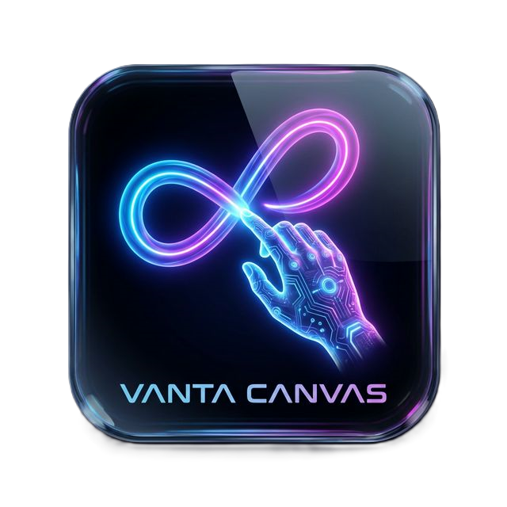

<p align="center">
  
</p>

# Vanta Canvas

**Vanta Canvas** is an immersive, browser-based gesture drawing experience where your hands become the creative tools. Draw shapes in the air using hand gestures via your webcam, and watch as they magically inflate into soft, floating 3D balloon objects in a shared scene.

> **Note**: This project transforms 2D air gestures into 3D art using advanced computer vision and WebGL technologies.

[](https://vantacanvas.vercel.app)

## Features

- **Gesture-Based Drawing**: Use your index finger to sketch in the air with precision.
- **Real-Time 3D Inflation**: Completed shapes automatically inflate into puffy, physically-simulated 3D balloon objects.
- **Multiplayer Collaboration**: Invite friends to join your room and create art together in real-time using PeerJS.
- **Interactive Physics**: Grab, move, rotate, and poke your 3D creations using natural hand gestures.
- **Advanced Hand Tracking**: Powered by MediaPipe for high-performance, low-latency hand detection.
- **Dynamic Camera Preview**: Draggable and resizable camera view to keep your workspace clear.
- **Responsive Design**: Optimized for desktops, tablets, and mobile devices.

## How It Works

1.  **Draw**: Extend your index finger (keep other fingers curled) to draw lines.
2.  **Inflate**: Hold an open palm for 0.5 seconds to close the shape and inflate it into 3D.
3.  **Interact**: Pinch with your thumb and index finger to grab and move objects.
4.  **Clear**: Use the "Clear" button to wipe the scene.

## Gesture Controls

| Gesture | Action |
| :--- | :--- |
| **Point (Index Finger)** | Draw lines in 3D space |
| **Open Palm (Hold)** | Close current shape and inflate |
| **Pinch** | Grab, move, and rotate objects |

## Technology Stack

This project is built with a modern stack of open-source technologies:

-   **[Vite](https://vitejs.dev/)**: Next-generation frontend tooling.
-   **[TypeScript](https://www.typescriptlang.org/)**: For type-safe, robust code.
-   **[Three.js](https://threejs.org/)**: Powerful 3D library for WebGL rendering.
-   **[MediaPipe Hands](https://developers.google.com/mediapipe/solutions/vision/hand_landmarker)**: State-of-the-art hand tracking.
-   **[GSAP](https://greensock.com/gsap/)**: Professional-grade animation library.
-   **[PeerJS](https://peerjs.com/)**: Simple WebRTC for multiplayer connectivity.

## Installation

To run Vanta Canvas locally:

1.  **Clone the repository:**
    ```bash
    git clone https://github.com/D3b0j33t/VantaCanvas.git
    cd VantaCanvas
    ```

2.  **Install dependencies:**
    ```bash
    npm install
    ```

3.  **Start the development server:**
    ```bash
    npm run dev
    ```

4.  **Open in Browser:**
    Navigate to `http://localhost:5173` (or the URL shown in your terminal).

## Requirements

-   A modern browser with WebGL support (Chrome, Edge, Firefox, Safari).
-   A webcam for hand tracking.
-   Good lighting conditions for best detection results.
-   **HTTPS** is required for camera access if hosting online.

## Credits

**Designed & Developed by [Debojeet Bhowmick](https://debojeet-bhowmick.netlify.app)**

---

*Based on the AirCanvas experimental project.*

## License

Copyright (c) 2026 Debojeet Bhowmick. All rights reserved.

This software is provided under a **restricted license**:

1.  **Usage Rights**: You are granted a limited, non-exclusive, non-transferable license to use this software for personal, non-commercial purposes only.
2.  **No Redistribution**: You may not redistribute, sell, lease, license, rent, or otherwise transfer this software without prior written consent.
3.  **No Modification**: You may not modify, reverse engineer, decompile, or disassemble this software.
4.  **Ownership**: All title and intellectual property rights remain with Debojeet Bhowmick.

For full terms, see the [LICENSE](LICENSE) file.
